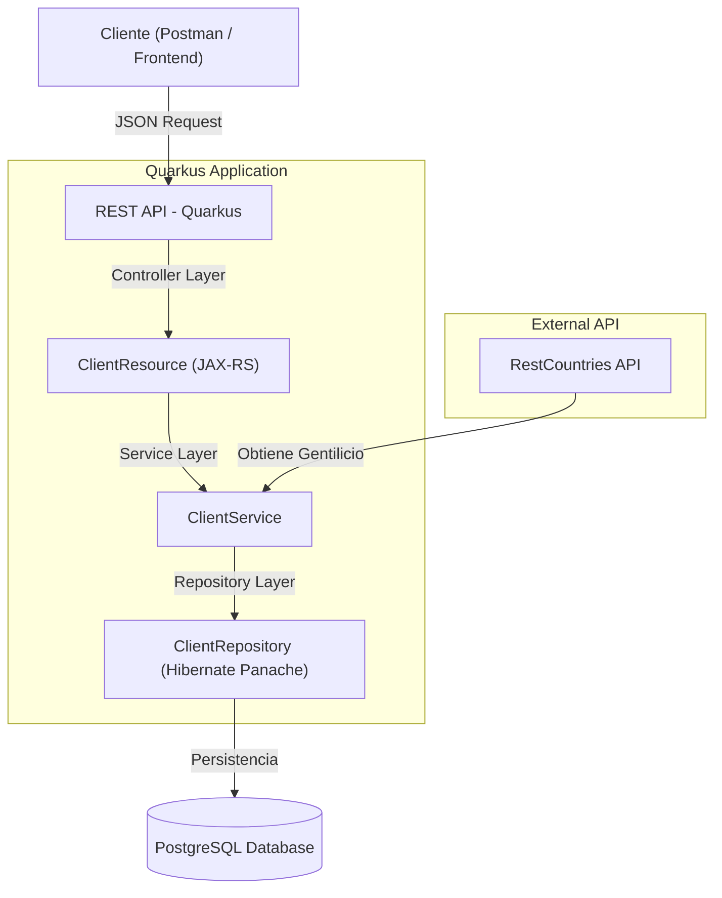

```mermaid
graph TD
  A["Cliente (Postman / Frontend)"] -->|JSON Request| B["REST API - Quarkus"]

  subgraph Quarkus Application
    B -->|Controller Layer| C["ClientResource (JAX-RS)"]
    C -->|Service Layer| D["ClientService"]
    D -->|Repository Layer| E["ClientRepository (Hibernate Panache)"]
  end

  E -->|Persistencia| F[("PostgreSQL Database")]

  subgraph External API
    G["RestCountries API"] -->|Obtiene Gentilicio| D
  end
```